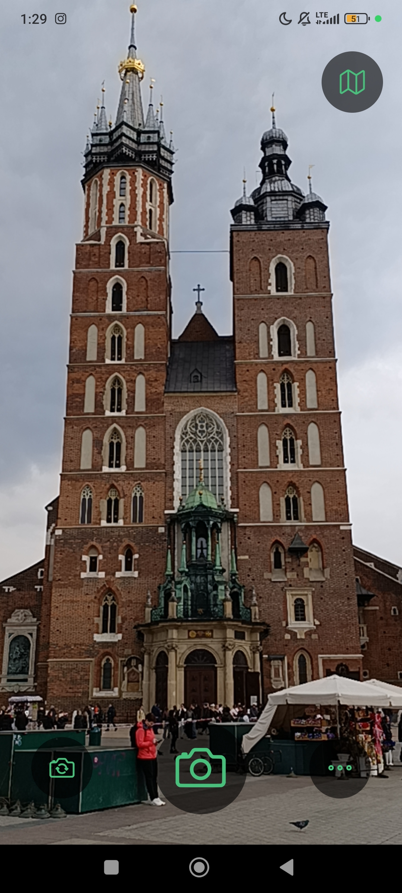
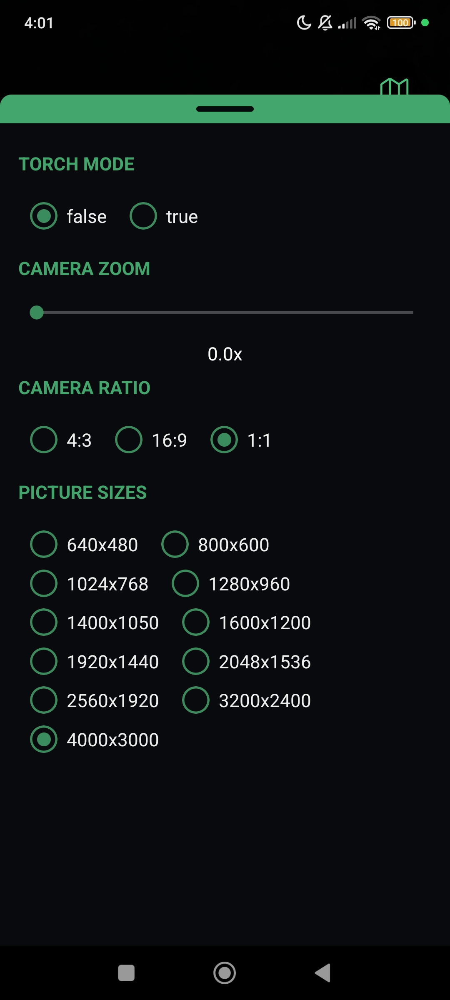
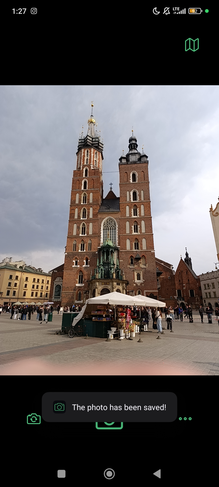
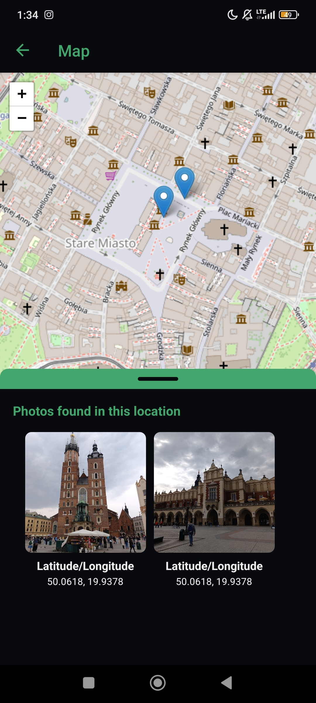
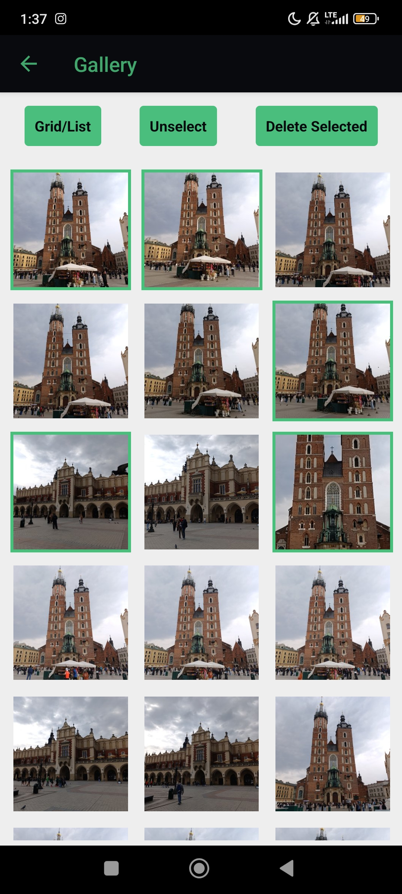
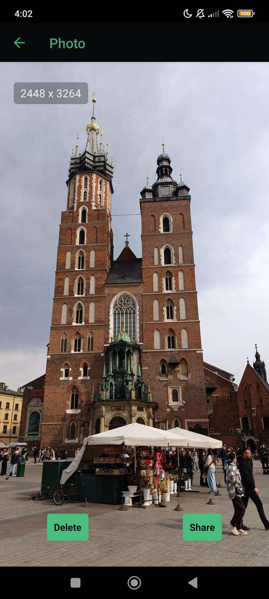

# 📷 CameraApp

<p align="center">
  
</p>

A React Native mobile camera application built with Expo. Take photos with full camera controls, browse your gallery, and see where each photo was taken on an interactive map.

---

## ⚠️ Compatibility
Built with **Expo SDK 52**. 
Expo Go currently (April 2026) supports **SDK 55** — run via development build or downgrade.

---

## Screenshots

<p align="center">
  
  
  
</p>
<p align="center">
  
  
  
</p>

---

## Features

- 📸 **Camera** — take photos with front/back camera switching
- 🔦 **Torch control** — toggle flashlight on/off
- 🔍 **Zoom** — adjustable zoom slider (0–2×)
- 📐 **Aspect ratio** — choose between 4:3, 16:9 and 1:1
- 🖼️ **Resolution** — select picture size from 640×480 up to 4000×3000
- 🗺️ **Location tagging** — each photo is saved with GPS coordinates
- 🖼️ **Gallery** — browse all photos in grid or list view
- ☑️ **Multi-select** — long press to select photos, delete in bulk
- 🔍 **Full-screen view** — open any photo, see its resolution, share or delete it
- 📍 **Map** — view photo locations as markers on an interactive OpenStreetMap
- 📂 **Location bottom sheet** — tap a map marker to see all photos taken there

---

## Screens

### Main Screen
Home screen with two buttons — navigate to the Gallery or the Camera.

### Camera Screen
Full-screen camera viewfinder with:
- Shutter button to take a photo
- Flip button to switch between front and back camera
- Map button (top right) to navigate to the Map screen
- Settings button (bottom right) to open the settings bottom sheet

### Camera Settings (Bottom Sheet)
Swipe-up panel with:
- Torch mode toggle (On/Off)
- Zoom slider
- Aspect ratio selection (4:3, 16:9, 1:1)
- Picture size selection

### Gallery Screen
Grid/list view of all photos on the device with:
- **Grid/List** toggle button
- **Long press** to select photos
- **Unselect** to clear selection
- **Delete Selected** to remove chosen photos
- **Tap** a photo to open it in full screen

### Big Photo Screen
Full-screen photo viewer showing:
- Photo resolution (top left)
- **Delete** button to remove the photo
- **Share** button to share via other apps

### Map Screen
Interactive map (OpenStreetMap via Leaflet) showing markers at locations where photos were taken. Tap a marker to open a bottom sheet with thumbnail previews of all photos taken at that spot. Tap a thumbnail to open it in the Big Photo screen.

---

## Getting Started

### Prerequisites

- [Node.js](https://nodejs.org/) (v18 or later)
- [Expo CLI](https://docs.expo.dev/get-started/installation/)
- [Expo Go](https://expo.dev/client) app on your Android device, or an Android emulator

### Installation

```bash
git clone https://github.com/Avareez/Camera-App
cd Camera-App
npm install
```

### Running

```bash
npx expo start
```

Scan the QR code with **Expo Go** on your Android device, or press `a` to open in an Android emulator.

> ⚠️ The app is designed and tested on **Android only**. Some features (ToastAndroid, navigation bar color) are Android-specific and may not work on iOS.

---

## Permissions

The app requests the following permissions at runtime:

| Permission | Used for |
|---|---|
| Camera | Taking photos |
| Media Library | Saving and reading photos from device storage |
| Location (Foreground) | Tagging photos with GPS coordinates |

---

## Tech Stack

- **React Native** + **Expo**
- **expo-camera** — camera viewfinder and controls
- **expo-media-library** — saving and reading photos
- **expo-location** — GPS coordinates
- **expo-sharing** — sharing photos
- **AsyncStorage** — storing photo metadata with location
- **React Navigation** — screen navigation
- **Leaflet.js** (via WebView) — interactive map
- **@gorhom/bottom-sheet** — settings and map bottom sheets